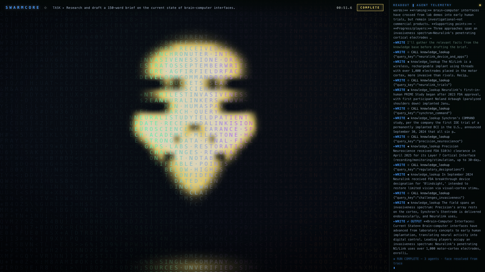
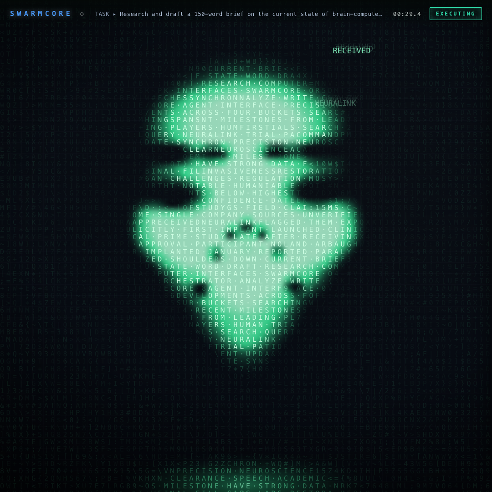
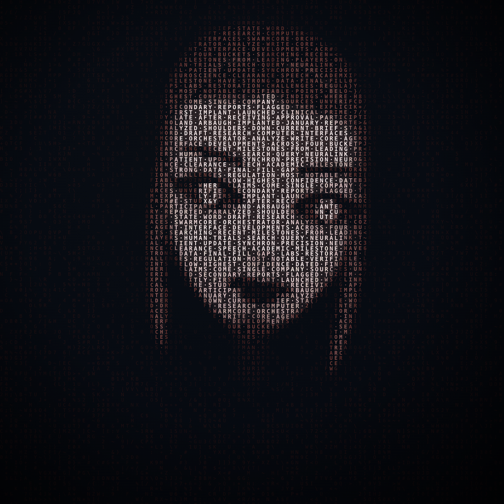

# SWARMCORE

**A replayable visualization of a multi-agent AI system's reasoning trace — a
human face rendered entirely in living code, on a dark bio-mechanical /
*System Shock* terminal.**

A dense field of monospace characters out of which a **face made of code**
slowly resolves as three AI sub-agents do their work, alongside a live terminal
readout printing the swarm's actual reasoning. When the run pauses for human
guidance, the face **rolls its head to the side** — a curious, listening tilt —
and flushes red. During its heaviest thinking it slowly **rolls its neck**.
Autoplays, loops, scrubs; drop any `trace.json` onto it to replay your own run.


<p align="center"></p>

<p align="center"><em>▶ the loop, resolving out of the code — <a href="docs/loop.mp4">MP4 version</a></em></p>



<p align="center"> </p>

---

## The idea

SWARMCORE is a piece of **generative data-art built on top of a real system**.
Underneath the aesthetic, an actual multi-agent pipeline ran: an **orchestrator**
model reasoned about a task and split it into three roles; three **sub-agents**
— *research*, *analyze*, *write* — went off and did the work, calling real tools
(live web search, a knowledge base) and passing results down the chain, with a
human reaching in **once** to steer a tool call mid-flight. Every reasoning step,
tool call, and result was captured to `trace.json`.

The visualization then replays that trace as a **portrait of the swarm's own
mind** — a human face rendered entirely from a churning field of monospace
characters. The face is not a picture pasted on top; it is *made of the run*.
As the three agents work, the portrait **resolves out of the noise**, and the
face **travels the colour wheel with its reasoning** — resting **blue** when it
thinks, **cyan** as it reaches for a tool, **green** as results land, **violet**
when it doubts its own data, **red** when a human reaches in to steer, and
**gold** as it resolves — one jewel-hue at a time. The mind **exhales its
actions**: on each tool call the action word (`WEB_SEARCH`, `KNOWLEDGE_LOOKUP`, …)
**fires outward** and waits at the rim while the tool works, then on the result
the answer **rushes back**, dissolves into the face boundary, imprints into the
word-face, and the whole portrait **flares**. The head itself speaks: it
**rolls to the side** when the swarm asks its human for guidance, and slowly
**circles its neck** through the heaviest stretches of thought. It's a single
looping image that says, in one glance: *this is what a collaborating group of
AI agents — and the person guiding them — actually looks like, and feels like,
from the inside.*

## What this is (and what it isn't)

This is a **replayable artifact**, not a live agent runner. It ships with one
pre-generated run and autoplays it on a loop — but it is also a **player**: a
timeline scrubber, keyboard transport, and drag-and-drop loading of any
`trace.json` make it usable as a viewer for every run the generator produces.

The agent trace it replays is **real Anthropic API output** — the orchestrator's
extended-thinking plan, each sub-agent's stated intent, the actual tool-use
blocks (real `web_search` + a custom `knowledge_lookup` tool), the tool results,
and each sub-agent's final output are all captured verbatim from live API calls.

**The one exception** is a single, deliberately-injected *human steering*
checkpoint. It is a fabricated moment showing a person editing a tool input
mid-flight (original vs. edited input + a one-line rationale). It is labeled
explicitly in the data with `"simulated_steering": true` and rendered on screen
as `SIMULATED — not a model action`, so it can never be mistaken for the model's
own behaviour. **Everything else in the trace is 100% real.**

---

## Repository layout

```
SWARMCORE/
├── trace-generator/
│   └── generate_trace.py     # makes real Anthropic API calls → trace.json
├── visualizer/
│   ├── index.html            # the self-contained replay (inline CSS + JS)
│   ├── trace.json            # the trace the visualizer replays
│   └── trace-data.js         # same trace as a JS fallback (for file:// use)
└── README.md
```

---

## Quick start (just watch it)

The visualizer is fully self-contained — no build step.

**Option A — open the file directly.** Double-click `visualizer/index.html`.
It loads the trace from `trace-data.js` (a browser blocks `fetch()` on
`file://`, which is why that JS fallback exists).

**Option B — static server (recommended for recording).**

```bash
cd visualizer
python3 -m http.server 8000
# then open http://localhost:8000
```

It autoplays on load and **loops** (with a ~3 s hold on the `COMPLETE` state)
so you never have to scrub.

### Playback controls

- **Floating bar** — Play/Pause · Restart · 1×/2× speed. It (and the cursor)
  auto-hide after ~3 s idle, so recordings stay clean.
- **Timeline scrubber** — a thin state-coloured bar along the bottom; click or
  drag anywhere to jump. The terminal log and emotional state rebuild to match.
- **Keyboard** — `Space` play/pause · `R` restart · `1`/`2` speed · `←`/`→`
  seek ±5 s · `D` toggle the debug affect console.
- **Drag & drop** — drop any generator-produced `trace.json` onto the page and
  it replays that run on the spot.
- **URL params** — `?speed=2` start at 2×, `?rec` hide every control (pure
  canvas + terminal, for recording), `?debug` show the affect console.

---

## Regenerating the trace (make your own real run)

The committed trace was produced by `trace-generator/generate_trace.py`. To make
a fresh one you need Anthropic API credentials.

```bash
pip install anthropic
export ANTHROPIC_API_KEY=sk-ant-...        # your key
python trace-generator/generate_trace.py   # writes visualizer/trace.json + trace-data.js
```

That's it — reload the visualizer and it replays the new run.

**Optional environment overrides** (no code edits needed):

| Variable | Default | Effect |
|---|---|---|
| `SWARMCORE_TASK` | the BCI brief | Run the swarm on **any task** — the whole pipeline adapts. The orchestrator decomposes it, research uses live `web_search`, and the analyze/write `knowledge_lookup` KB (plus the steering target) is distilled from the research agent's real findings. Nothing task-specific is hardcoded. |
| `SWARMCORE_LABEL_EMOTIONS` | `1` | Set `0` to skip the emotion-labeling pass (the frontend heuristic still colours the trace). |
| `SWARMCORE_EMOTION_MODEL` | `claude-haiku-4-5-20251001` | Which (cheap) model labels each step's emotional state. |

What the generator does (disciplined scope — one task, exactly three
sub-agents, one checkpoint):

1. **Orchestrator call** — Claude Opus 4.8 with extended (adaptive) thinking
   decomposes the task (default: *"Research and draft a 150-word brief on the
   current state of brain-computer interfaces"*) into exactly three subtasks
   (`research` / `analyze` / `write`) as structured JSON. The model's real
   thinking/plan text is captured verbatim — the visualizer replays it as the
   run's opening "planning" beat.
2. **Three sub-agent calls with real tool use** —
   - `research` → real **`web_search`** server tool
   - the research findings are then **distilled into a task-specific knowledge
     base** (4–6 keyed facts + a steering target) by a structured-output call
   - `analyze` and `write` → a custom **`knowledge_lookup`** tool over that KB,
     run in a real tool-use loop.
   For each we capture the stated intent, the real `tool_use` block, the tool
   result, and the final output.
3. **One injected steering checkpoint** — inserted into the `analyze` sub-agent
   after its first tool call is proposed but before it "executes": the original
   tool input, an edited version redirecting to the KB entry a human overseer
   would flag, and a one-line rationale. Flagged `simulated_steering: true`.
   Nothing else is fabricated.

Each step carries a synthetic, evenly-spaced `timestamp_ms` (~1.1 s apart) so the
frontend can animate the replay at a natural pace.

> **Auth note.** The generator also accepts a Claude-Code-style OAuth bearer
> token via `ANTHROPIC_OAUTH_TOKEN` (it adds the required `oauth-2025-04-20` beta
> header for you). A standard `ANTHROPIC_API_KEY` is the simplest path.

### trace.json shape

```json
{
  "task": "…",
  "model": "claude-opus-4-8",
  "orchestrator": { "planning_text": "…", "subtasks": [ { "id", "role", "instruction" } ] },
  "subagents": [
    { "id", "role", "steps": [
      { "type": "reasoning" | "tool_call" | "tool_result" | "checkpoint",
        "content": …, "timestamp_ms": 0,
        "emotion": {                       // OPTIONAL — added by the labeling pass
          "state": "focus" | "seek" | "synthesis" | "doubt" | "alert" | "resolve",
          "arousal": 0,                    // 0–100
          "valence": 0.0,                  // -1..1
          "conf": 0.0                      // 0..1 — used only when >= 0.5
        }
      }
    ] }
  ]
}
```

> The `emotion` field is **optional and additive**. If it's absent (as in the
> committed trace), the visualizer classifies each step with a built-in JS
> heuristic and renders identically — the label just lets a real model judgement
> override the heuristic when it's confident (`conf >= 0.5`).

---

## The visualization

- **The face.** The centrepiece is a **typographic portrait** — a human face
  rendered entirely out of a dense field of monospace characters (a face *made of
  code*, drawn on an HTML canvas). The face is not pre-baked: it **materialises out
  of the noise** as the trace replays, brightening region by region as the three
  agents work, and holds fully-resolved on the `COMPLETE` state before the loop
  dissolves it back into code.
- **Crisp glyphs, sketched portrait.** The whole head is filled with the trace's
  real words in reading order, and each cell's **brightness follows a drawn
  portrait mask** — a shaded head silhouette with path-drawn features (slender
  arched brows, winged almond eyes with a luminous iris + glint, full sculpted
  lips) painted at 4×
  supersample and read back per cell. Bright cheekbones and forehead spell in full
  light, the dark liner and mouth line spell dim, so the portrait's own
  light-and-shadow is what reads as features — **every character stays readable**;
  there is no blur or bloom layered over the text. Tone is carried the way a
  typographic print carries it: by **coverage** — three glyph weight buckets
  (heavier + larger in the highlights) plus a crisp cell-aligned phosphor backfill
  behind the lit face only. Outside the head the ambient field runs full strength;
  **inside** it, the field is gated away so the eyes and mouth read clean.
- **The machine has a face — hers.** The portrait is a woman, SHODAN-adjacent
  in spirit but human in structure: long centre-parted hair falling past the
  jaw in dark waves, a soft oval face with light on the cheekbones, slender
  arched brows, winged dark-lashed eyes with luminous irises, full sculpted
  lips, and a faint etched **circuit trace** down one cheek. The resting
  expression is a calm, level gaze — composed, never saccharine; joy arrives
  as a knowing smile.
- **A face made of real words.** The lit portrait is not random glyphs — the
  trace's actual vocabulary (`NEURALINK`, `SYNCHRON`, `PRECISION NEUROSCIENCE`,
  `ORCHESTRATOR`, `RESTORATION`, `CLEARANCE`, …) is flowed through the head cells, so
  the face literally spells the run's own content. The dark background stays random
  and shimmers; the face's words are held stable (the churn skips them) and accrete
  as keywords fly in.
- **A face that expresses itself.** Six facial expressions are pre-built (one per
  state, on a **4× supersampled** canvas so the curves are smooth at glyph
  resolution) and the live face **eases between them**. The head has two motion
  channels beyond the expression: a **whole-head roll** about the neck and a
  feature-level tilt. Brows knit and the eyes narrow to a glare on **DOUBT** (plus
  a small **shudder**); on **ALERT** the head **tilts to the side** — imperious,
  listening, "what would you have me do?" — with arched brows, wide eyes and
  barely-parted lips; a lidded **smirk** on **SYNTH** / **RSLV**.
- **The head thinks with its neck.** Through the heaviest stretches of reasoning —
  the orchestrator's opening plan, a long compose step — the head slowly **rolls its
  neck** in a full, easing circle (eight keyframe masks stepped through in time),
  the way someone loosens up over a hard problem. It cancels the instant an outward
  state (a tool call, an alert) takes over.
- **Emotional / rational states — the full colour wheel.** Each replayed step is
  classified into one of six affective states, and the whole face **eases toward
  that state's colour and motion**. Because only *one* state is ever active, the
  face is a single jewel-hue at any instant that **travels the wheel over the run**.
  Every highlight blooms to *its own* tinted-white, on a deliberately
  **hue-neutral graphite frame**. Layered over that travelling state hue, tool
  activity carries its own identity colours (below) — two separate channels:
  **FACE = how it feels · PULSE = which tool is working.**

  | State | Bus | Hue | Fires on | Expression + motion |
  |---|---|---|---|---|
  | **FOCUS** | `F` | blue `#3884ff` (home) | calm reasoning / planning | level gaze, resting breath; neck-roll on deep thought |
  | **SEEK** | `S` | cyan `#2cd1f2` | a `tool_call` (reaching out) | brows arch, eyes widen + dart |
  | **SYNTH** | `Y` | green `#34e896` | results land / insight | lidded smirk; a brief inward **flare** |
  | **DOUBT** | `D` | violet `#9648f0` | mismatch / data-quality flag | knit brow, narrowed downcast eyes, **crimson furrow** + a **shudder** |
  | **ALERT** | `A` | red `#fa4023` | the human steering checkpoint | **head tilts to the side**, brows arch, eyes wide, lips barely part |
  | **RSLV** | `R` | gold→white `#ffe373` | final, confident output | serene smile; **crystallizes** (churn drops, edges snap, holds) |

- **Action out, answer back.** The mind **exhales its action**: on a `tool_call`
  the tool word (`WEB_SEARCH`, `KNOWLEDGE_LOOKUP`, …) **fires outward** from the face
  and hangs at the rim while the tool "works out there" — but the word only
  materialises once it has cleared the head, so it never slides across the portrait.
  On the `tool_result` the answer **rushes back**, **dissolves into the face
  boundary** (the imprint glow + a whole-portrait **flare** take over from there),
  and imprints its word into the face. A dead-end result instead **scatters** the
  word before it lands and the face flinches into doubt. Reasoning steps give a
  small outward *murmur*. All flights are seeded, so the loop records identically.
- **Tool pulses — the second colour channel.** Every `tool_call` / `tool_result` /
  steering checkpoint also fires a labeled **expanding double-ring** from the acting
  agent's zone (`⟐ WEB_SEARCH`, `◀ KNOWLEDGE_LOOKUP`, `✎ STEERING`), coloured by
  **tool identity**: `web_search` ice-blue, `knowledge_lookup` violet, human
  steering amber, anything else chrome-teal. The flying action/answer words carry
  the same identity hue. Several tools in flight = several hues alive at once,
  layered over the face's single state colour.
- **Palette.** A **hue-neutral graphite frame** (near-black `#04060c`→`#070b12`
  background, cool-neutral circuit texture and vignette, graphite borders) so the
  JS owns every saturated pixel — the face's single travelling jewel-hue is the
  only chroma on screen. The six state hues are listed above.
- **Debug affect console.** Hidden from viewers by default (it is an instrument for
  screenshot debugging, not part of the piece). Toggle it with the `D` key or
  `?debug` in the URL: mood word, numeric **AROUSAL / VALENCE**, a six-segment
  `F·S·Y·D·A·R` **state bus** with decaying afterglow, and a **live EEG trace**.
- **Replay.** As the trace plays in timestamp order, each step lights the active
  agent's zone of the face. A gentle per-cell shimmer keeps the field alive; the
  churn skips the face's word-cells so the vocabulary stays legible.
- **The checkpoint moment.** This is the **ALERT** state: the **head rolls to the
  side** and the whole face **flushes red**, a **scanline sweep** crosses the canvas
  (`STATUS: AWAITING INPUT`), and the side terminal prints the original-vs-edited
  instruction and rationale with a typewriter effect. It holds ~2.5 s, then resumes.
- **The finale (signature).** On `COMPLETE`, the whole run's palette **sweeps across
  the face as a full-wheel rainbow** — the one instant every hue appears at once —
  then collapses into the serene **gold** resolve as the face settles into a smile
  and crystallizes, held for the loop's end-hold before it dissolves and repeats.
- **HUD.** A persistent header with the task name, an elapsed-time clock, and a
  `STATUS` readout that changes colour with the live state
  (`EXECUTING` → `AWAITING INPUT` → `COMPLETE`).
- **Terminal panel.** Fixed-width monospace, cool-neutral text, a subtle
  scanline overlay, and a 1-frame chromatic-aberration glitch on state
  transitions.

The portrait is drawn on a **`<canvas>`** (a path-drawn, 4×-supersampled portrait
mask → per-character brightness, weight-bucketed glyphs and a cell-aligned
phosphor backfill — no blur layers over the text), with SVG-free CSS effects for
the sweep and glitch. No frameworks, no external requests, no fonts fetched — it
works fully offline.

---

## Recording a clip

The committed `docs/loop.mp4` / `docs/loop.gif` were captured **deterministically**
via headless Chrome driven on a virtualized clock (every frame byte-stable), so a
regenerated trace can be re-recorded identically. To capture by hand instead:

1. Open the visualizer with **`?rec`** (hides every control — pure canvas +
   terminal) and let it loop. Add `&speed=2` for a punchier ~27 s loop.
2. Record the canvas with **QuickTime** ( *File → New Screen Recording* ), a
   browser extension, or OBS.
3. Crop to the canvas area. Good export sizes: **1080×1080** (square, social) or
   **1920×1080** (landscape).

---

## Roadmap — toward a live, less-manual pipeline

Today the trace is generated once (fixed scope) and replayed. The direction is to
make the whole thing **drive off arbitrary input with less hand-authoring**:

1. **Arbitrary tasks (shipped).** `SWARMCORE_TASK` runs the swarm on any task and
   the *whole* trace adapts: the orchestrator decomposes the task, research uses
   live `web_search`, and the analyze/write `knowledge_lookup` KB (plus the steering
   target) is **distilled from the research agent's real findings** at build time —
   no task-specific facts are hardcoded. The next step is closing the loop with the
   live streaming path below.
2. **Model-labeled affect (shipped).** The emotion-labeling pass (`step.emotion`)
   is the seam where a model, not a hand-tuned heuristic, decides state. It is
   enum-constrained to the six frontend states, conf-gated, and back-compat.
3. **A hosted "router" model (next).** Replace the batched build-time call with a
   small hosted endpoint that, given raw input or a live step, returns
   `{state, arousal, valence, conf}` (and, for decomposition, the sub-agent split).
   The renderer already consumes exactly this shape, so nothing in the
   visualization changes — only *where* the labels come from. The Claude API is
   the reference implementation of that endpoint for now.
4. **Live streaming (later).** Point the visualizer at a live run instead of a
   recorded `trace.json`: stream steps in over WebSocket/SSE, classify each on
   arrival (client heuristic first, hosted model to confirm), and let the face
   react in real time — the same emotional instrument, but for a run happening now.

The design deliberately keeps the **renderer decoupled** from *how* states are
produced, so each step above is a drop-in swap behind the `step.emotion` contract.

---

## Notes

- Built with vanilla HTML/CSS/JS — no dependencies at runtime.
- The generator targets `claude-opus-4-8` with adaptive extended thinking and
  real server/custom tools via the official `anthropic` Python SDK; the optional
  emotion-labeling pass uses a cheaper model (`claude-haiku-4-5` by default).
- The six emotional states, the keyword-intake animation, and the affect console
  (mood / arousal-valence / `F·S·Y·D·A·R` bus / EEG) all run inside the single
  canvas render loop — no new dependencies, still fully offline.
